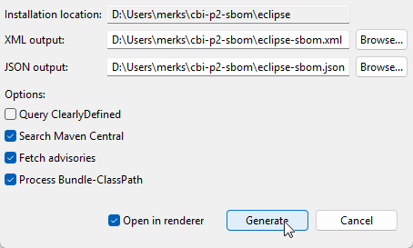

# IDE Integration

The CBI p2 SBOM Generator provides IDE Integration.

## Tool Installation

Use `Help → Install New Software` with the following site to install the generator into any IDE:
 
`https://download.eclipse.org/cbi/updates/p2-sbom/tools/nightly/latest/`

## Generate a Self SBOM

Use `Help → Generate SBOM...` to generate an SBOM for the host IDE installation:

### Generate Self SBOM Wizard

The wizard provides support for various options:

In particular, the following options can be specified:

- [`-json-output-file`](cli-guide.md#-json-output-file)
- [`-xml-output-file`](cli-guide.md#-xml-output-file)
- [`-clearly-defined`](cli-guide.md#-clearly-defined)
- [`-central-search`](cli-guide.md#-central-search)
- [`-advisory`](cli-guide.md#-advisory)
- [`-process-bundle-classpath`](cli-guide.md#-process-bundle-classpath)
