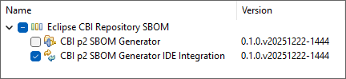
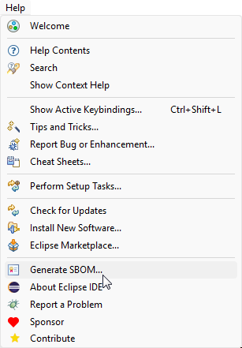
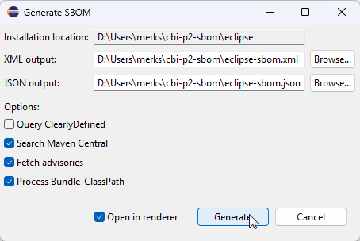
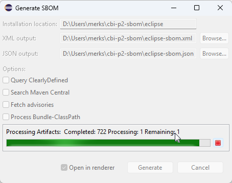
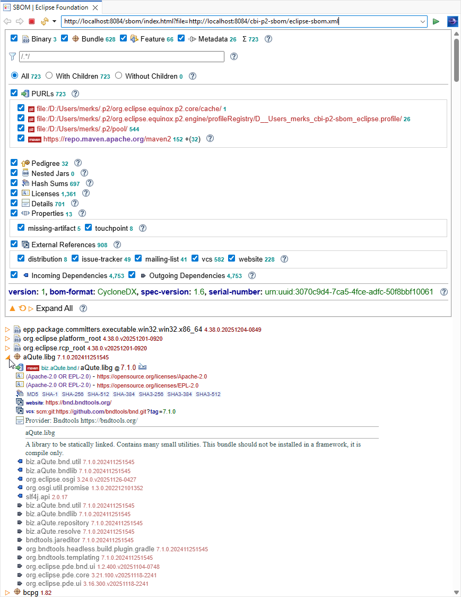
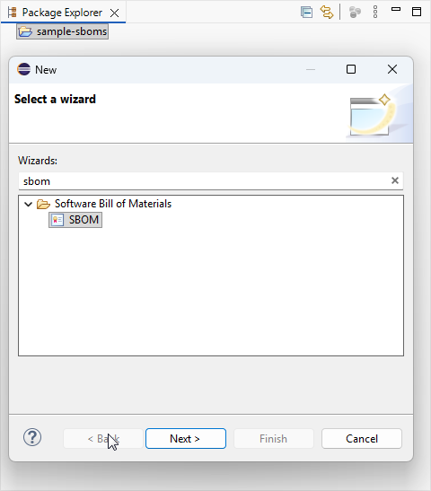
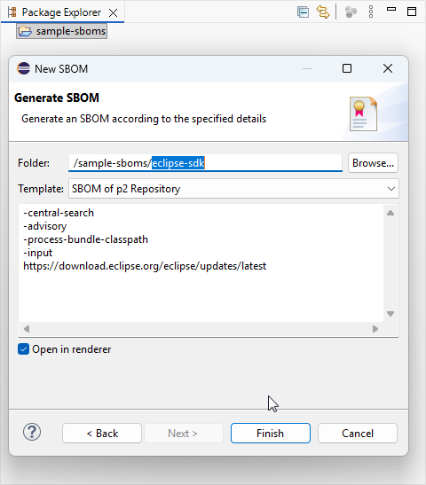
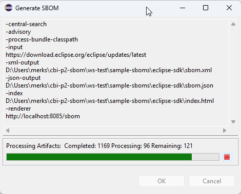
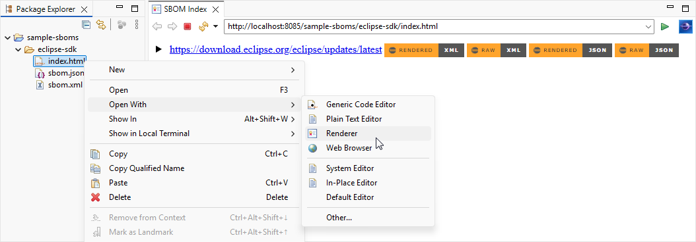

# IDE Integration

The CBI p2 SBOM Generator provides IDE Integration for generating and reviewing SBOMs.

## Tool Installation

Use `Help → Install New Software...` with the following site to install the generator into any IDE:
 
`https://download.eclipse.org/cbi/updates/p2-sbom/tools/nightly/latest`

## Generate a Self SBOM

Use `Help → Generate SBOM...` to generate an SBOM for the host IDE installation:

### Generate SBOM Wizard

The wizard provides support for various options:

In particular, the following options can be specified:

- [`-json-output-file`](cli-guide.md#-json-output-file)
- [`-xml-output-file`](cli-guide.md#-xml-output-file)
- [`-clearly-defined`](cli-guide.md#-clearly-defined)
- [`-central-search`](cli-guide.md#-central-search)
- [`-advisory`](cli-guide.md#-advisory)
- [`-process-bundle-classpath`](cli-guide.md#-process-bundle-classpath)

The dialog is non-modal and shows progress while generating the SBOM.

When generation completes successfully,
the wizard optionally opens the generated SBOM in the integrated SBOM renderer.

## Integrated SBOM Renderer

The tools support viewing rendered SBOMs via a specialized editor that uses the IDE's internal browser.

## New SBOM Wizard

The tools support creating an SBOM directly in the IDE using `File → New → Other...` to launch the wizard:

The `Folder` must specify a folder within an existing project,
but the folder itself need not yet exist
and will be created by the generator,
e.g., here `eclipse-sdk`.
A number `Template` choices are available,
but you can change the text to specify any valid [command line arguments](cli-guide.md).

Completing the wizard will start the generation process via a non-modal dialog:

If specified, the [integrated SBOM renderer](#integrated-sbom-renderer) will be automatically opened.

## SBOM Index Renderer

The integrated SBOM renderer supports opening an `index.html` which provides links for both the rendered and raw results:

This can optionally be automatically opened by the [New SBOM Wizard](#new-sbom-wizard).
At any later point in time,
 you can use the context menu's `Open With → Renderer` to open the integrated SBOM renderer. 
