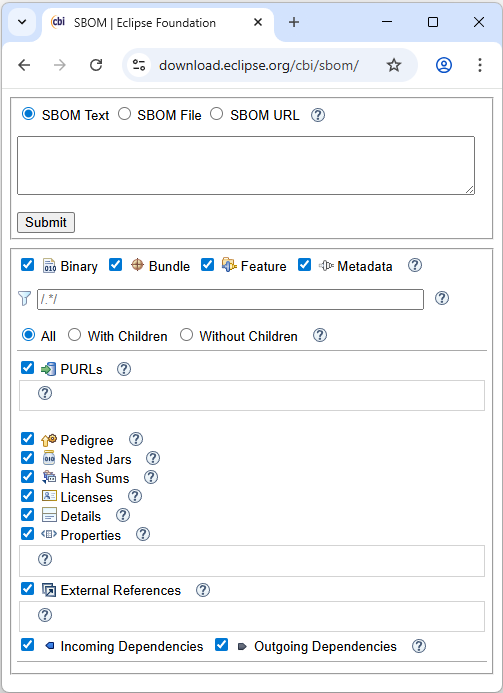
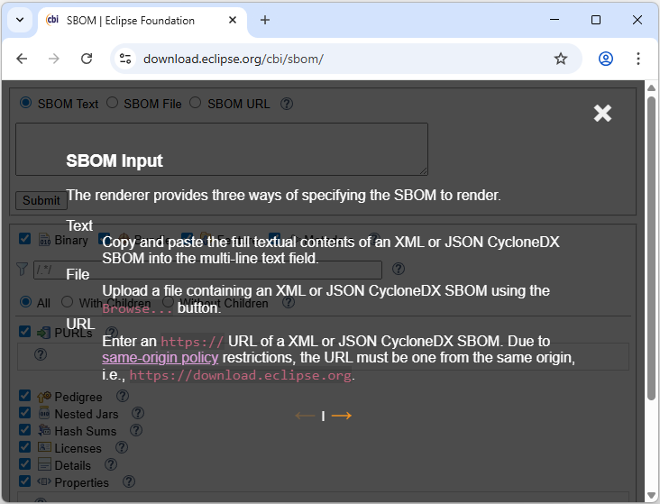
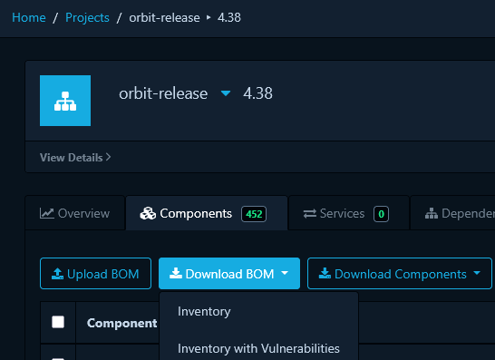
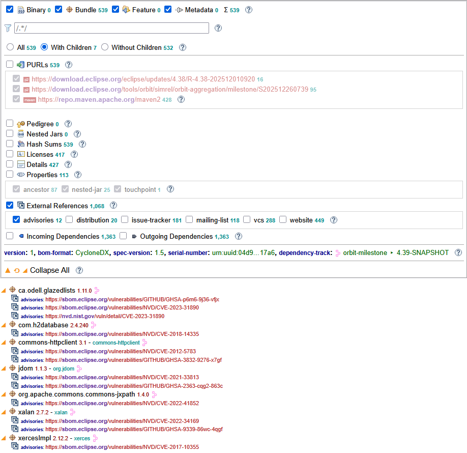

# Web-based SBOM Renderer

The CBI p2 SBOM Generator provides a web-based renderer for viewing and analyzing SBOMs.
It is designed to render [CycloneDX](https://cyclonedx.org/) SBOMs of the form 
produced by the generator,
produced by [tycho-sbom](overview.md#tycho-sbom),
and as downloaded from [dependency-track](https://dependencytrack.org/).

For use at `eclipse.org` the renderer is hosted at
[https://download.eclipse.org/cbi/sbom/](https://download.eclipse.org/cbi/sbom/).

The view is augmented with help icons,
i.e., ,
that provides documentation within the renderer itself.
The following is the documentation for specifying the input to the renderer:

The full content of the web site is available in the folder
[https://github.com/eclipse-cbi/p2repo-sbom/tree/main/www](https://github.com/eclipse-cbi/p2repo-sbom/tree/main/www)
and is easily hosted anywhere with no special host requirements.
The [Integrated SBOM Renderer](ide-guide.md#integrated-sbom-renderer)
programmatically [copies the site](https://github.com/eclipse-cbi/p2repo-sbom/blob/59f5dcf10ecc66a117202c0b81ed29bd93435233/plugins/org.eclipse.cbi.p2repo.sbom.ui/src/org/eclipse/cbi/p2repo/sbom/ui/SBOMRenderer.java#L181-L207)
and starts a simple local web server to make the site available via `localhost`.

## Specifying a Query Parameter

The input URI can be directly specified as a `file=` query parameter to the render.

`https://download.eclipse.org/cbi/sbom/?file=<uri>`

This supports specifying convenient links a rendered SBOM,
e.g.,
[ SimRel 2025-12 SBOM](https://download.eclipse.org/cbi/sbom/?file=https://download.eclipse.org/releases/2025-12/202512101000/buildInfo/sbom/simrel/sbom.xml).

Such links are also used in the generated [`-index`](cli-guide.md#-index-file) pages, e.g.,

- [`https://download.eclipse.org/releases/2025-12/202512101000/buildInfo/sbom/epp/`](https://download.eclipse.org/releases/2025-12/202512101000/buildInfo/sbom/epp/)

## Dependency-track

At `eclipse.org`,
projects can use [`https://sbom.eclipse.org`](https://sbom.eclipse.org)
to upload SBOMs and analyze them for vulnerabilities.
The generator can be used to generate an SBOM that is uploaded to `sbom.eclipse.org`
as described in the [Maven/Jenkins Integration](build-guide.md) guide.
Such an SBOM can subsequently be downloaded, enhanced with vulnerabilities details, for viewing in the renderer
using `Components → Download BOM → Inventory with Vulnerabilities`:

### Dependency-track Vulnerabilities

The vulnerabilities are rendered as external references of type `advisories`,
i.e., the same way as those generated by [`-advisory`](cli-guide.md#-advisory).

Here we've filtered to show only components `With Children`
and to show only `External References` of type `advisories` as children.

